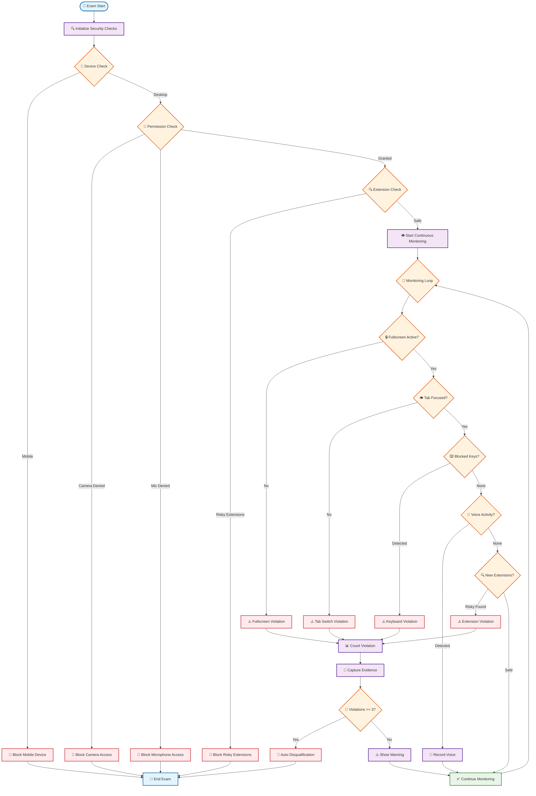

# Anti-Cheat System Architecture

## 1. System Architecture Diagram - Anti-Cheat Detection

```mermaid
graph TB
    subgraph "Client Browser Environment"
        subgraph "Student Interface Layer"
            UI[🖥️ Student Exam Interface]
            Timer[⏱️ Exam Timer]
            Questions[📝 Question Display]
            Camera[📷 Camera Preview]
        end
        
        subgraph "Anti-Cheat Detection Layer"
            subgraph "Device Monitoring"
                DeviceCheck[💻 Device Type Check]
                ScreenCheck[🖥️ Screen Count Monitor]
                ResolutionCheck[📐 Resolution Validator]
            end
            
            subgraph "Permission Monitoring"
                CameraAccess[📷 Camera Access Monitor]
                MicAccess[🎤 Microphone Access Monitor]
                PermissionTracker[🔐 Permission State Tracker]
            end
            
            subgraph "Browser Security"
                FullscreenLock[🔒 Fullscreen Lock]
                TabDetection[🔍 Tab Switch Detection]
                WindowFocus[👁️ Window Focus Monitor]
                KeyboardBlock[⌨️ Keyboard Shortcut Blocker]
                CopyPasteBlock[📋 Copy/Paste Blocker]
                DevToolsBlock[🛠️ DevTools Blocker]
            end
            
            subgraph "Extension Detection"
                ExtensionScanner[🔍 Extension Scanner]
                AIDetector[🤖 AI Assistant Detector]
                TranslatorDetector[🌐 Translator Detector]
                CommunicationDetector[💬 Communication Tool Detector]
                RiskAssessment[⚠️ Risk Assessment Engine]
            end
            
            subgraph "Audio/Visual Monitoring"
                VoiceDetection[🎤 Voice Activity Detection]
                AudioRecorder[🎵 Audio Recorder]
                PhotoCapture[📸 Violation Photo Capture]
                FaceDetection[👤 Face Detection]
            end
        end
        
        subgraph "Violation Management"
            ViolationCounter[📊 Violation Counter]
            ViolationLogger[📝 Violation Logger]
            PhotoStorage[🗄️ Photo Storage]
            AudioStorage[🎵 Audio Storage]
            DisqualificationEngine[🚫 Auto Disqualification]
        end
    end
    
    subgraph "Firebase Backend"
        subgraph "Real-time Database"
            SessionData[📊 Session Data]
            ViolationData[⚠️ Violation Records]
            PhotoData[📸 Violation Photos]
            AudioData[🎵 Voice Recordings]
        end
        
        subgraph "Storage"
            FirebaseStorage[☁️ Firebase Storage]
            ViolationPhotos[📷 Violation Photo Files]
            VoiceRecordings[🎤 Voice Recording Files]
        end
    end
    
    subgraph "Teacher Monitoring Dashboard"
        RealTimeMonitor[👁️ Real-time Monitor]
        ViolationViewer[📸 Violation Photo Viewer]
        VoicePlayer[🔊 Voice Recording Player]
        StudentTracker[👥 Student Status Tracker]
    end
    
    %% Connections - Device & Permission Monitoring
    UI --> DeviceCheck
    UI --> ScreenCheck
    UI --> ResolutionCheck
    UI --> CameraAccess
    UI --> MicAccess
    
    DeviceCheck --> PermissionTracker
    ScreenCheck --> PermissionTracker
    CameraAccess --> PermissionTracker
    MicAccess --> PermissionTracker
    
    %% Connections - Browser Security
    UI --> FullscreenLock
    UI --> TabDetection
    UI --> WindowFocus
    UI --> KeyboardBlock
    UI --> CopyPasteBlock
    UI --> DevToolsBlock
    
    %% Connections - Extension Detection
    ExtensionScanner --> AIDetector
    ExtensionScanner --> TranslatorDetector
    ExtensionScanner --> CommunicationDetector
    AIDetector --> RiskAssessment
    TranslatorDetector --> RiskAssessment
    CommunicationDetector --> RiskAssessment
    
    %% Connections - Audio/Visual Monitoring
    MicAccess --> VoiceDetection
    VoiceDetection --> AudioRecorder
    CameraAccess --> PhotoCapture
    CameraAccess --> FaceDetection
    
    %% Connections - Violation Management
    TabDetection --> ViolationCounter
    WindowFocus --> ViolationCounter
    KeyboardBlock --> ViolationCounter
    CopyPasteBlock --> ViolationCounter
    DevToolsBlock --> ViolationCounter
    RiskAssessment --> ViolationCounter
    
    ViolationCounter --> ViolationLogger
    ViolationCounter --> PhotoCapture
    ViolationCounter --> DisqualificationEngine
    
    PhotoCapture --> PhotoStorage
    AudioRecorder --> AudioStorage
    
    %% Connections - Backend Storage
    ViolationLogger --> SessionData
    ViolationLogger --> ViolationData
    PhotoStorage --> PhotoData
    AudioStorage --> AudioData
    
    PhotoData --> FirebaseStorage
    AudioData --> FirebaseStorage
    PhotoStorage --> ViolationPhotos
    AudioStorage --> VoiceRecordings
    
    %% Connections - Teacher Dashboard
    SessionData --> RealTimeMonitor
    ViolationData --> RealTimeMonitor
    ViolationPhotos --> ViolationViewer
    VoiceRecordings --> VoicePlayer
    SessionData --> StudentTracker
    
    %% Styling
    classDef clientLayer fill:#e3f2fd,stroke:#1976d2,stroke-width:2px
    classDef securityLayer fill:#ffebee,stroke:#c62828,stroke-width:2px
    classDef monitoringLayer fill:#f3e5f5,stroke:#7b1fa2,stroke-width:2px
    classDef backendLayer fill:#e8f5e8,stroke:#388e3c,stroke-width:2px
    classDef teacherLayer fill:#fff3e0,stroke:#f57c00,stroke-width:2px
    
    class UI,Timer,Questions,Camera clientLayer
    class FullscreenLock,TabDetection,WindowFocus,KeyboardBlock,CopyPasteBlock,DevToolsBlock,ExtensionScanner,AIDetector,TranslatorDetector,CommunicationDetector,RiskAssessment securityLayer
    class VoiceDetection,AudioRecorder,PhotoCapture,FaceDetection,ViolationCounter,ViolationLogger,PhotoStorage,AudioStorage,DisqualificationEngine monitoringLayer
    class SessionData,ViolationData,PhotoData,AudioData,FirebaseStorage,ViolationPhotos,VoiceRecordings backendLayer
    class RealTimeMonitor,ViolationViewer,VoicePlayer,StudentTracker teacherLayer
```

## 2. Information Architecture - Anti-Cheat Data Flow

```mermaid
graph TD
    subgraph "Data Collection Layer"
        subgraph "Device Information"
            DeviceType[📱 Device Type]
            ScreenInfo[🖥️ Screen Information]
            BrowserInfo[🌐 Browser Information]
            ResolutionData[📐 Resolution Data]
        end
        
        subgraph "Permission Status"
            CameraPermission[📷 Camera Permission]
            MicPermission[🎤 Microphone Permission]
            FullscreenStatus[🔒 Fullscreen Status]
            FocusStatus[👁️ Focus Status]
        end
        
        subgraph "Extension Data"
            ExtensionList[📋 Installed Extensions]
            ExtensionRisk[⚠️ Risk Assessment]
            ExtensionStatus[🔍 Active Status]
        end
        
        subgraph "Behavioral Data"
            KeyboardEvents[⌨️ Keyboard Events]
            MouseEvents[🖱️ Mouse Events]
            TabSwitches[🔄 Tab Switches]
            WindowChanges[🪟 Window Changes]
        end
        
        subgraph "Audio/Visual Data"
            VoiceActivity[🎤 Voice Activity]
            AudioRecordings[🎵 Audio Recordings]
            CameraFrames[📷 Camera Frames]
            ViolationPhotos[📸 Violation Photos]
        end
    end
    
    subgraph "Processing Layer"
        subgraph "Real-time Analysis"
            DeviceValidator[✅ Device Validator]
            PermissionMonitor[🔐 Permission Monitor]
            ExtensionAnalyzer[🔍 Extension Analyzer]
            BehaviorAnalyzer[📊 Behavior Analyzer]
            AudioProcessor[🎵 Audio Processor]
        end
        
        subgraph "Violation Detection"
            ViolationDetector[🚨 Violation Detector]
            RiskCalculator[📈 Risk Calculator]
            ThresholdChecker[⚖️ Threshold Checker]
            ActionTrigger[🎯 Action Trigger]
        end
        
        subgraph "Evidence Collection"
            PhotoCapture[📸 Photo Capture]
            AudioCapture[🎤 Audio Capture]
            MetadataCollector[📋 Metadata Collector]
            TimestampGenerator[⏰ Timestamp Generator]
        end
    end
    
    subgraph "Storage Layer"
        subgraph "Session Storage"
            SessionState[💾 Session State]
            ViolationCount[🔢 Violation Count]
            StudentInfo[👤 Student Info]
            ExamProgress[📊 Exam Progress]
        end
        
        subgraph "Evidence Storage"
            ViolationRecords[📝 Violation Records]
            PhotoStorage[🗄️ Photo Storage]
            AudioStorage[🎵 Audio Storage]
            LogStorage[📋 Log Storage]
        end
        
        subgraph "Firebase Collections"
            SessionsCollection[📊 sessions/]
            ViolationsCollection[⚠️ violations/]
            PhotosCollection[📷 photos/]
            AudioCollection[🎤 audio/]
        end
    end
    
    subgraph "Presentation Layer"
        subgraph "Student Interface"
            DeviceStatus[📱 Device Status]
            PermissionStatus[🔐 Permission Status]
            ViolationWarnings[⚠️ Violation Warnings]
            ExamInterface[📝 Exam Interface]
        end
        
        subgraph "Teacher Dashboard"
            RealTimeView[👁️ Real-time View]
            ViolationGallery[🖼️ Violation Gallery]
            AudioPlayback[🔊 Audio Playback]
            StudentList[👥 Student List]
            ReportsView[📊 Reports View]
        end
    end
    
    %% Data Flow Connections
    DeviceType --> DeviceValidator
    ScreenInfo --> DeviceValidator
    BrowserInfo --> DeviceValidator
    ResolutionData --> DeviceValidator
    
    CameraPermission --> PermissionMonitor
    MicPermission --> PermissionMonitor
    FullscreenStatus --> PermissionMonitor
    FocusStatus --> PermissionMonitor
    
    ExtensionList --> ExtensionAnalyzer
    ExtensionRisk --> ExtensionAnalyzer
    ExtensionStatus --> ExtensionAnalyzer
    
    KeyboardEvents --> BehaviorAnalyzer
    MouseEvents --> BehaviorAnalyzer
    TabSwitches --> BehaviorAnalyzer
    WindowChanges --> BehaviorAnalyzer
    
    VoiceActivity --> AudioProcessor
    AudioRecordings --> AudioProcessor
    CameraFrames --> AudioProcessor
    
    DeviceValidator --> ViolationDetector
    PermissionMonitor --> ViolationDetector
    ExtensionAnalyzer --> ViolationDetector
    BehaviorAnalyzer --> ViolationDetector
    AudioProcessor --> ViolationDetector
    
    ViolationDetector --> RiskCalculator
    RiskCalculator --> ThresholdChecker
    ThresholdChecker --> ActionTrigger
    
    ActionTrigger --> PhotoCapture
    ActionTrigger --> AudioCapture
    ActionTrigger --> MetadataCollector
    
    PhotoCapture --> TimestampGenerator
    AudioCapture --> TimestampGenerator
    MetadataCollector --> TimestampGenerator
    
    ViolationDetector --> SessionState
    ViolationDetector --> ViolationCount
    TimestampGenerator --> ViolationRecords
    PhotoCapture --> PhotoStorage
    AudioCapture --> AudioStorage
    
    SessionState --> SessionsCollection
    ViolationRecords --> ViolationsCollection
    PhotoStorage --> PhotosCollection
    AudioStorage --> AudioCollection
    
    SessionsCollection --> RealTimeView
    ViolationsCollection --> ViolationGallery
    PhotosCollection --> ViolationGallery
    AudioCollection --> AudioPlayback
    
    PermissionMonitor --> DeviceStatus
    PermissionMonitor --> PermissionStatus
    ViolationDetector --> ViolationWarnings
    SessionState --> ExamInterface
    
    %% Styling
    classDef dataLayer fill:#e8eaf6,stroke:#3f51b5,stroke-width:2px
    classDef processLayer fill:#fce4ec,stroke:#e91e63,stroke-width:2px
    classDef storageLayer fill:#e0f2f1,stroke:#4caf50,stroke-width:2px
    classDef presentationLayer fill:#fff3e0,stroke:#ff9800,stroke-width:2px
    
    class DeviceType,ScreenInfo,BrowserInfo,ResolutionData,CameraPermission,MicPermission,FullscreenStatus,FocusStatus,ExtensionList,ExtensionRisk,ExtensionStatus,KeyboardEvents,MouseEvents,TabSwitches,WindowChanges,VoiceActivity,AudioRecordings,CameraFrames,ViolationPhotos dataLayer
    
    class DeviceValidator,PermissionMonitor,ExtensionAnalyzer,BehaviorAnalyzer,AudioProcessor,ViolationDetector,RiskCalculator,ThresholdChecker,ActionTrigger,PhotoCapture,AudioCapture,MetadataCollector,TimestampGenerator processLayer
    
    class SessionState,ViolationCount,StudentInfo,ExamProgress,ViolationRecords,PhotoStorage,AudioStorage,LogStorage,SessionsCollection,ViolationsCollection,PhotosCollection,AudioCollection storageLayer
    
    class DeviceStatus,PermissionStatus,ViolationWarnings,ExamInterface,RealTimeView,ViolationGallery,AudioPlayback,StudentList,ReportsView presentationLayer
```

## 3. Anti-Cheat Detection Flow

```mermaid
flowchart TD
    Start([🚀 Exam Start]) --> InitChecks[🔍 Initialize Security Checks]
    
    InitChecks --> DeviceCheck{📱 Device Check}
    DeviceCheck -->|Mobile| BlockMobile[🚫 Block Mobile Device]
    DeviceCheck -->|Desktop| PermissionCheck{🔐 Permission Check}
    
    PermissionCheck -->|Camera Denied| BlockCamera[🚫 Block Camera Access]
    PermissionCheck -->|Mic Denied| BlockMic[🚫 Block Microphone Access]
    PermissionCheck -->|Granted| ExtensionCheck{🔍 Extension Check}
    
    ExtensionCheck -->|Risky Extensions| BlockExtensions[🚫 Block Risky Extensions]
    ExtensionCheck -->|Safe| StartMonitoring[👁️ Start Continuous Monitoring]
    
    StartMonitoring --> MonitoringLoop{🔄 Monitoring Loop}
    
    MonitoringLoop --> CheckFullscreen{🔒 Fullscreen Active?}
    CheckFullscreen -->|No| ViolationFS[⚠️ Fullscreen Violation]
    CheckFullscreen -->|Yes| CheckTabFocus{👁️ Tab Focused?}
    
    CheckTabFocus -->|No| ViolationTab[⚠️ Tab Switch Violation]
    CheckTabFocus -->|Yes| CheckKeyboard{⌨️ Blocked Keys?}
    
    CheckKeyboard -->|Detected| ViolationKey[⚠️ Keyboard Violation]
    CheckKeyboard -->|None| CheckVoice{🎤 Voice Activity?}
    
    CheckVoice -->|Detected| RecordVoice[🎵 Record Voice]
    CheckVoice -->|None| CheckExtensions{🔍 New Extensions?}
    
    CheckExtensions -->|Risky Found| ViolationExt[⚠️ Extension Violation]
    CheckExtensions -->|Safe| ContinueMonitoring[✅ Continue Monitoring]
    
    ViolationFS --> CountViolation[📊 Count Violation]
    ViolationTab --> CountViolation
    ViolationKey --> CountViolation
    ViolationExt --> CountViolation
    
    CountViolation --> CaptureEvidence[📸 Capture Evidence]
    CaptureEvidence --> CheckViolationLimit{🔢 Violations >= 3?}
    
    CheckViolationLimit -->|Yes| AutoDisqualify[🚫 Auto Disqualification]
    CheckViolationLimit -->|No| ShowWarning[⚠️ Show Warning]
    
    ShowWarning --> ContinueMonitoring
    RecordVoice --> ContinueMonitoring
    ContinueMonitoring --> MonitoringLoop
    
    AutoDisqualify --> EndExam[🏁 End Exam]
    BlockMobile --> EndExam
    BlockCamera --> EndExam
    BlockMic --> EndExam
    BlockExtensions --> EndExam
    
    %% Styling
    classDef startEnd fill:#e1f5fe,stroke:#01579b,stroke-width:2px
    classDef process fill:#f3e5f5,stroke:#4a148c,stroke-width:2px
    classDef decision fill:#fff3e0,stroke:#e65100,stroke-width:2px
    classDef violation fill:#ffebee,stroke:#c62828,stroke-width:2px
    classDef success fill:#e8f5e8,stroke:#2e7d32,stroke-width:2px
    
    class Start,EndExam startEnd
    class InitChecks,StartMonitoring,CountViolation,CaptureEvidence,ShowWarning,RecordVoice,ContinueMonitoring process
    class DeviceCheck,PermissionCheck,ExtensionCheck,MonitoringLoop,CheckFullscreen,CheckTabFocus,CheckKeyboard,CheckVoice,CheckExtensions,CheckViolationLimit decision
    class BlockMobile,BlockCamera,BlockMic,BlockExtensions,ViolationFS,ViolationTab,ViolationKey,ViolationExt,AutoDisqualify violation
    class ContinueMonitoring success
```