# Multi-Modal Architecture - Sistem Ujian Online

## Multi-Modal Architecture Diagram

```mermaid
graph TB
    subgraph "Input Modalities"
        subgraph "Visual Input"
            Camera[📷 Camera Stream]
            ScreenCapture[🖥️ Screen Capture]
            FaceDetection[👤 Face Detection]
            GestureRecognition[👋 Gesture Recognition]
            EyeTracking[👁️ Eye Tracking]
        end
        
        subgraph "Audio Input"
            Microphone[🎤 Microphone Stream]
            VoiceDetection[🗣️ Voice Activity Detection]
            SpeechRecognition[🎯 Speech Recognition]
            AudioAnalysis[🎵 Audio Pattern Analysis]
            NoiseDetection[🔊 Background Noise Detection]
        end
        
        subgraph "Text Input"
            KeyboardInput[⌨️ Keyboard Input]
            TextAnalysis[📝 Text Pattern Analysis]
            TypingBehavior[⚡ Typing Behavior Analysis]
            LanguageDetection[🌐 Language Detection]
        end
        
        subgraph "Behavioral Input"
            MouseMovement[🖱️ Mouse Movement]
            ClickPatterns[👆 Click Patterns]
            ScrollBehavior[📜 Scroll Behavior]
            WindowInteraction[🪟 Window Interaction]
            TabSwitching[🔄 Tab Switching]
        end
        
        subgraph "Device Input"
            DeviceOrientation[📱 Device Orientation]
            ScreenResolution[📐 Screen Resolution]
            BatteryStatus[🔋 Battery Status]
            NetworkStatus[🌐 Network Status]
            SystemResources[💾 System Resources]
        end
    end
    
    subgraph "Multi-Modal Processing Engine"
        subgraph "AI/ML Models"
            VADModel[🤖 Voice Activity Detection Model]
            FaceRecognitionModel[👤 Face Recognition Model]
            BehaviorAnalysisModel[📊 Behavior Analysis Model]
            AnomalyDetectionModel[🚨 Anomaly Detection Model]
            RiskAssessmentModel[⚖️ Risk Assessment Model]
        end
        
        subgraph "Data Fusion Layer"
            ModalityFusion[🔗 Modality Fusion Engine]
            TemporalAlignment[⏰ Temporal Alignment]
            ContextAggregation[📋 Context Aggregation]
            FeatureExtraction[🎯 Feature Extraction]
            PatternMatching[🔍 Pattern Matching]
        end
        
        subgraph "Decision Engine"
            RuleEngine[📏 Rule-based Engine]
            MLClassifier[🧠 ML Classifier]
            ThresholdManager[⚖️ Threshold Manager]
            ConfidenceScoring[📊 Confidence Scoring]
            ActionDecision[🎯 Action Decision]
        end
    end
    
    subgraph "Output Modalities"
        subgraph "Visual Output"
            UIAlerts[🚨 UI Alerts]
            ProgressIndicators[📊 Progress Indicators]
            StatusDisplays[📋 Status Displays]
            ViolationOverlays[⚠️ Violation Overlays]
            CameraPreview[📹 Camera Preview]
        end
        
        subgraph "Audio Output"
            AudioAlerts[🔊 Audio Alerts]
            VoiceWarnings[🗣️ Voice Warnings]
            SystemSounds[🎵 System Sounds]
            AudioFeedback[🎤 Audio Feedback]
        end
        
        subgraph "Haptic Output"
            Vibrations[📳 Vibrations]
            ScreenShake[📱 Screen Shake]
            CursorEffects[🖱️ Cursor Effects]
        end
        
        subgraph "Data Output"
            RealTimeData[📊 Real-time Data Stream]
            ViolationLogs[📝 Violation Logs]
            BehaviorMetrics[📈 Behavior Metrics]
            SessionRecords[💾 Session Records]
            EvidenceFiles[🗄️ Evidence Files]
        end
    end
    
    subgraph "Storage & Communication"
        subgraph "Local Storage"
            LocalCache[💾 Local Cache]
            TempStorage[📁 Temporary Storage]
            SessionStorage[🗃️ Session Storage]
        end
        
        subgraph "Cloud Storage"
            FirebaseDB[☁️ Firebase Database]
            FileStorage[📁 File Storage]
            RealTimeDB[⚡ Real-time Database]
        end
        
        subgraph "Communication Channels"
            WebRTC[📡 WebRTC]
            WebSockets[🔌 WebSockets]
            HTTPRequests[🌐 HTTP Requests]
            EventStreams[📊 Event Streams]
        end
    end
    
    %% Input to Processing Connections
    Camera --> VADModel
    Camera --> FaceRecognitionModel
    Microphone --> VADModel
    VoiceDetection --> VADModel
    MouseMovement --> BehaviorAnalysisModel
    ClickPatterns --> BehaviorAnalysisModel
    KeyboardInput --> BehaviorAnalysisModel
    TabSwitching --> AnomalyDetectionModel
    
    %% Processing Internal Connections
    VADModel --> ModalityFusion
    FaceRecognitionModel --> ModalityFusion
    BehaviorAnalysisModel --> ModalityFusion
    AnomalyDetectionModel --> ModalityFusion
    
    ModalityFusion --> TemporalAlignment
    TemporalAlignment --> ContextAggregation
    ContextAggregation --> FeatureExtraction
    FeatureExtraction --> PatternMatching
    
    PatternMatching --> RuleEngine
    PatternMatching --> MLClassifier
    RuleEngine --> ThresholdManager
    MLClassifier --> ConfidenceScoring
    ThresholdManager --> ActionDecision
    ConfidenceScoring --> ActionDecision
    
    ActionDecision --> RiskAssessmentModel
    RiskAssessmentModel --> ActionDecision
    
    %% Processing to Output Connections
    ActionDecision --> UIAlerts
    ActionDecision --> AudioAlerts
    ActionDecision --> Vibrations
    ActionDecision --> RealTimeData
    ActionDecision --> ViolationLogs
    
    RiskAssessmentModel --> StatusDisplays
    BehaviorAnalysisModel --> BehaviorMetrics
    ModalityFusion --> SessionRecords
    
    %% Storage Connections
    ViolationLogs --> LocalCache
    SessionRecords --> SessionStorage
    EvidenceFiles --> TempStorage
    
    LocalCache --> FirebaseDB
    SessionStorage --> RealTimeDB
    TempStorage --> FileStorage
    
    %% Communication Connections
    RealTimeData --> WebRTC
    ViolationLogs --> WebSockets
    SessionRecords --> HTTPRequests
    BehaviorMetrics --> EventStreams
    
    %% Styling
    classDef inputLayer fill:#e3f2fd,stroke:#1976d2,stroke-width:2px
    classDef processingLayer fill:#f3e5f5,stroke:#7b1fa2,stroke-width:2px
    classDef outputLayer fill:#e8f5e8,stroke:#388e3c,stroke-width:2px
    classDef storageLayer fill:#fff3e0,stroke:#f57c00,stroke-width:2px
    
    class Camera,ScreenCapture,FaceDetection,GestureRecognition,EyeTracking,Microphone,VoiceDetection,SpeechRecognition,AudioAnalysis,NoiseDetection,KeyboardInput,TextAnalysis,TypingBehavior,LanguageDetection,MouseMovement,ClickPatterns,ScrollBehavior,WindowInteraction,TabSwitching,DeviceOrientation,ScreenResolution,BatteryStatus,NetworkStatus,SystemResources inputLayer
    
    class VADModel,FaceRecognitionModel,BehaviorAnalysisModel,AnomalyDetectionModel,RiskAssessmentModel,ModalityFusion,TemporalAlignment,ContextAggregation,FeatureExtraction,PatternMatching,RuleEngine,MLClassifier,ThresholdManager,ConfidenceScoring,ActionDecision processingLayer
    
    class UIAlerts,ProgressIndicators,StatusDisplays,ViolationOverlays,CameraPreview,AudioAlerts,VoiceWarnings,SystemSounds,AudioFeedback,Vibrations,ScreenShake,CursorEffects,RealTimeData,ViolationLogs,BehaviorMetrics,SessionRecords,EvidenceFiles outputLayer
    
    class LocalCache,TempStorage,SessionStorage,FirebaseDB,FileStorage,RealTimeDB,WebRTC,WebSockets,HTTPRequests,EventStreams storageLayer
```



## Multi-Modal Data Flow Architecture

```mermaid
flowchart LR
    subgraph "Sensory Input Layer"
        subgraph "Visual Sensors"
            V1[📷 Front Camera]
            V2[🖥️ Screen Monitor]
            V3[👁️ Eye Tracker]
            V4[👋 Gesture Sensor]
        end
        
        subgraph "Audio Sensors"
            A1[🎤 Primary Microphone]
            A2[🔊 System Audio]
            A3[🎧 Headphone Monitor]
            A4[📻 Ambient Audio]
        end
        
        subgraph "Interaction Sensors"
            I1[⌨️ Keyboard Sensor]
            I2[🖱️ Mouse Sensor]
            I3[👆 Touch Sensor]
            I4[🪟 Window Sensor]
        end
        
        subgraph "Context Sensors"
            C1[📱 Device Context]
            C2[🌐 Network Context]
            C3[⚡ System Context]
            C4[🔋 Power Context]
        end
    end
    
    subgraph "Feature Extraction Layer"
        subgraph "Visual Features"
            VF1[👤 Face Features]
            VF2[👁️ Gaze Features]
            VF3[🎭 Expression Features]
            VF4[📐 Pose Features]
        end
        
        subgraph "Audio Features"
            AF1[🎵 Spectral Features]
            AF2[🗣️ Voice Features]
            AF3[🔊 Volume Features]
            AF4[⏱️ Temporal Features]
        end
        
        subgraph "Behavioral Features"
            BF1[⚡ Typing Patterns]
            BF2[🖱️ Mouse Patterns]
            BF3[⏰ Timing Patterns]
            BF4[🔄 Interaction Patterns]
        end
        
        subgraph "Contextual Features"
            CF1[📊 Usage Patterns]
            CF2[🌐 Network Patterns]
            CF3[⚙️ System Patterns]
            CF4[🔋 Resource Patterns]
        end
    end
    
    subgraph "Fusion & Analysis Layer"
        subgraph "Multi-Modal Fusion"
            MF1[🔗 Early Fusion]
            MF2[🎯 Late Fusion]
            MF3[⚖️ Decision Fusion]
            MF4[📊 Feature Fusion]
        end
        
        subgraph "AI/ML Processing"
            ML1[🧠 Deep Learning Models]
            ML2[📈 Statistical Models]
            ML3[🎯 Classification Models]
            ML4[🚨 Anomaly Detection]
        end
        
        subgraph "Rule-Based Processing"
            RB1[📏 Threshold Rules]
            RB2[⏰ Temporal Rules]
            RB3[🔗 Correlation Rules]
            RB4[🎯 Context Rules]
        end
    end
    
    subgraph "Decision & Action Layer"
        subgraph "Risk Assessment"
            RA1[📊 Risk Scoring]
            RA2[⚖️ Confidence Weighting]
            RA3[🎯 Threat Classification]
            RA4[📈 Trend Analysis]
        end
        
        subgraph "Action Selection"
            AS1[⚠️ Warning Actions]
            AS2[📸 Evidence Collection]
            AS3[🚫 Blocking Actions]
            AS4[📊 Reporting Actions]
        end
    end
    
    subgraph "Output & Feedback Layer"
        subgraph "Student Feedback"
            SF1[🚨 Visual Alerts]
            SF2[🔊 Audio Warnings]
            SF3[📳 Haptic Feedback]
            SF4[🔒 Interface Locks]
        end
        
        subgraph "Teacher Dashboard"
            TD1[👁️ Real-time Monitor]
            TD2[📊 Analytics Dashboard]
            TD3[📸 Evidence Viewer]
            TD4[📈 Behavior Reports]
        end
        
        subgraph "System Actions"
            SA1[💾 Data Storage]
            SA2[📡 Real-time Sync]
            SA3[🚫 Auto Disqualification]
            SA4[📋 Audit Logging]
        end
    end
    
    %% Data Flow Connections
    V1 --> VF1
    V2 --> VF2
    V3 --> VF3
    V4 --> VF4
    
    A1 --> AF1
    A2 --> AF2
    A3 --> AF3
    A4 --> AF4
    
    I1 --> BF1
    I2 --> BF2
    I3 --> BF3
    I4 --> BF4
    
    C1 --> CF1
    C2 --> CF2
    C3 --> CF3
    C4 --> CF4
    
    VF1 --> MF1
    VF2 --> MF1
    AF1 --> MF2
    AF2 --> MF2
    BF1 --> MF3
    BF2 --> MF3
    CF1 --> MF4
    CF2 --> MF4
    
    MF1 --> ML1
    MF2 --> ML2
    MF3 --> ML3
    MF4 --> ML4
    
    VF3 --> RB1
    AF3 --> RB2
    BF3 --> RB3
    CF3 --> RB4
    
    ML1 --> RA1
    ML2 --> RA2
    ML3 --> RA3
    ML4 --> RA4
    
    RB1 --> RA1
    RB2 --> RA2
    RB3 --> RA3
    RB4 --> RA4
    
    RA1 --> AS1
    RA2 --> AS2
    RA3 --> AS3
    RA4 --> AS4
    
    AS1 --> SF1
    AS1 --> SF2
    AS2 --> SF3
    AS3 --> SF4
    
    AS1 --> TD1
    AS2 --> TD2
    AS3 --> TD3
    AS4 --> TD4
    
    AS1 --> SA1
    AS2 --> SA2
    AS3 --> SA3
    AS4 --> SA4
    
    %% Styling
    classDef inputLayer fill:#e3f2fd,stroke:#1976d2,stroke-width:2px
    classDef featureLayer fill:#f3e5f5,stroke:#7b1fa2,stroke-width:2px
    classDef fusionLayer fill:#e8f5e8,stroke:#388e3c,stroke-width:2px
    classDef decisionLayer fill:#fff3e0,stroke:#f57c00,stroke-width:2px
    classDef outputLayer fill:#fce4ec,stroke:#e91e63,stroke-width:2px
    
    class V1,V2,V3,V4,A1,A2,A3,A4,I1,I2,I3,I4,C1,C2,C3,C4 inputLayer
    class VF1,VF2,VF3,VF4,AF1,AF2,AF3,AF4,BF1,BF2,BF3,BF4,CF1,CF2,CF3,CF4 featureLayer
    class MF1,MF2,MF3,MF4,ML1,ML2,ML3,ML4,RB1,RB2,RB3,RB4 fusionLayer
    class RA1,RA2,RA3,RA4,AS1,AS2,AS3,AS4 decisionLayer
    class SF1,SF2,SF3,SF4,TD1,TD2,TD3,TD4,SA1,SA2,SA3,SA4 outputLayer
```



## Multi-Modal Integration Architecture

```mermaid
graph TB
    subgraph "Multi-Modal Input Processing"
        subgraph "Synchronous Inputs"
            SyncVideo[📹 Video Stream (30fps)]
            SyncAudio[🎤 Audio Stream (44.1kHz)]
            SyncMouse[🖱️ Mouse Events (Real-time)]
            SyncKeyboard[⌨️ Keyboard Events (Real-time)]
        end
        
        subgraph "Asynchronous Inputs"
            AsyncDevice[📱 Device Status (5s interval)]
            AsyncNetwork[🌐 Network Status (10s interval)]
            AsyncExtensions[🔍 Extension Scan (15s interval)]
            AsyncSystem[⚙️ System Resources (30s interval)]
        end
        
        subgraph "Event-Driven Inputs"
            EventFocus[👁️ Focus Change Events]
            EventFullscreen[🔒 Fullscreen Events]
            EventPermission[🔐 Permission Events]
            EventError[❌ Error Events]
        end
    end
    
    subgraph "Temporal Synchronization Engine"
        subgraph "Time Alignment"
            TimeSync[⏰ Time Synchronization]
            BufferManager[📊 Buffer Manager]
            FrameAlignment[🎬 Frame Alignment]
            EventQueue[📋 Event Queue]
        end
        
        subgraph "Data Correlation"
            CrossModal[🔗 Cross-Modal Correlation]
            TemporalWindow[⏱️ Temporal Window Analysis]
            CausalityDetection[🎯 Causality Detection]
            PatternAlignment[📐 Pattern Alignment]
        end
    end
    
    subgraph "Multi-Modal AI Engine"
        subgraph "Specialized Models"
            VisionModel[👁️ Computer Vision Model]
            AudioModel[🎵 Audio Processing Model]
            BehaviorModel[📊 Behavior Analysis Model]
            ContextModel[🧠 Context Understanding Model]
        end
        
        subgraph "Fusion Models"
            EarlyFusion[🔗 Early Fusion Network]
            LateFusion[🎯 Late Fusion Network]
            AttentionMechanism[🎯 Attention Mechanism]
            EnsembleModel[🤝 Ensemble Model]
        end
        
        subgraph "Decision Models"
            ClassificationHead[🎯 Classification Head]
            RegressionHead[📈 Regression Head]
            AnomalyHead[🚨 Anomaly Detection Head]
            ConfidenceHead[📊 Confidence Estimation Head]
        end
    end
    
    subgraph "Multi-Modal Output Generation"
        subgraph "Adaptive Responses"
            VisualResponse[👁️ Visual Response Generator]
            AudioResponse[🔊 Audio Response Generator]
            HapticResponse[📳 Haptic Response Generator]
            SystemResponse[⚙️ System Response Generator]
        end
        
        subgraph "Personalized Feedback"
            StudentProfile[👤 Student Profile Adapter]
            LearningStyle[🎓 Learning Style Adapter]
            AccessibilityAdapter[♿ Accessibility Adapter]
            LanguageAdapter[🌐 Language Adapter]
        end
        
        subgraph "Context-Aware Output"
            ExamContext[📝 Exam Context Adapter]
            TimeContext[⏰ Time Context Adapter]
            StressContext[😰 Stress Level Adapter]
            PerformanceContext[📊 Performance Adapter]
        end
    end
    
    subgraph "Feedback Loop & Learning"
        subgraph "Performance Monitoring"
            AccuracyTracker[🎯 Accuracy Tracker]
            FalsePositiveTracker[❌ False Positive Tracker]
            ResponseTimeTracker[⏱️ Response Time Tracker]
            UserSatisfactionTracker[😊 User Satisfaction Tracker]
        end
        
        subgraph "Model Adaptation"
            OnlineLearning[📚 Online Learning]
            ModelUpdater[🔄 Model Updater]
            ThresholdAdjuster[⚖️ Threshold Adjuster]
            FeatureSelector[🎯 Feature Selector]
        end
    end
    
    %% Input Processing Connections
    SyncVideo --> TimeSync
    SyncAudio --> TimeSync
    SyncMouse --> BufferManager
    SyncKeyboard --> BufferManager
    
    AsyncDevice --> EventQueue
    AsyncNetwork --> EventQueue
    AsyncExtensions --> EventQueue
    AsyncSystem --> EventQueue
    
    EventFocus --> FrameAlignment
    EventFullscreen --> FrameAlignment
    EventPermission --> FrameAlignment
    EventError --> FrameAlignment
    
    %% Synchronization Connections
    TimeSync --> CrossModal
    BufferManager --> TemporalWindow
    FrameAlignment --> CausalityDetection
    EventQueue --> PatternAlignment
    
    CrossModal --> VisionModel
    TemporalWindow --> AudioModel
    CausalityDetection --> BehaviorModel
    PatternAlignment --> ContextModel
    
    %% AI Processing Connections
    VisionModel --> EarlyFusion
    AudioModel --> EarlyFusion
    BehaviorModel --> LateFusion
    ContextModel --> LateFusion
    
    EarlyFusion --> AttentionMechanism
    LateFusion --> AttentionMechanism
    AttentionMechanism --> EnsembleModel
    
    EnsembleModel --> ClassificationHead
    EnsembleModel --> RegressionHead
    EnsembleModel --> AnomalyHead
    EnsembleModel --> ConfidenceHead
    
    %% Output Generation Connections
    ClassificationHead --> VisualResponse
    RegressionHead --> AudioResponse
    AnomalyHead --> HapticResponse
    ConfidenceHead --> SystemResponse
    
    VisualResponse --> StudentProfile
    AudioResponse --> LearningStyle
    HapticResponse --> AccessibilityAdapter
    SystemResponse --> LanguageAdapter
    
    StudentProfile --> ExamContext
    LearningStyle --> TimeContext
    AccessibilityAdapter --> StressContext
    LanguageAdapter --> PerformanceContext
    
    %% Feedback Connections
    ExamContext --> AccuracyTracker
    TimeContext --> FalsePositiveTracker
    StressContext --> ResponseTimeTracker
    PerformanceContext --> UserSatisfactionTracker
    
    AccuracyTracker --> OnlineLearning
    FalsePositiveTracker --> ModelUpdater
    ResponseTimeTracker --> ThresholdAdjuster
    UserSatisfactionTracker --> FeatureSelector
    
    OnlineLearning --> VisionModel
    ModelUpdater --> AudioModel
    ThresholdAdjuster --> BehaviorModel
    FeatureSelector --> ContextModel
    
    %% Styling
    classDef inputLayer fill:#e8eaf6,stroke:#3f51b5,stroke-width:2px
    classDef syncLayer fill:#e1f5fe,stroke:#0277bd,stroke-width:2px
    classDef aiLayer fill:#f3e5f5,stroke:#7b1fa2,stroke-width:2px
    classDef outputLayer fill:#e8f5e8,stroke:#388e3c,stroke-width:2px
    classDef feedbackLayer fill:#fff3e0,stroke:#f57c00,stroke-width:2px
    
    class SyncVideo,SyncAudio,SyncMouse,SyncKeyboard,AsyncDevice,AsyncNetwork,AsyncExtensions,AsyncSystem,EventFocus,EventFullscreen,EventPermission,EventError inputLayer
    
    class TimeSync,BufferManager,FrameAlignment,EventQueue,CrossModal,TemporalWindow,CausalityDetection,PatternAlignment syncLayer
    
    class VisionModel,AudioModel,BehaviorModel,ContextModel,EarlyFusion,LateFusion,AttentionMechanism,EnsembleModel,ClassificationHead,RegressionHead,AnomalyHead,ConfidenceHead aiLayer
    
    class VisualResponse,AudioResponse,HapticResponse,SystemResponse,StudentProfile,LearningStyle,AccessibilityAdapter,LanguageAdapter,ExamContext,TimeContext,StressContext,PerformanceContext outputLayer
    
    class AccuracyTracker,FalsePositiveTracker,ResponseTimeTracker,UserSatisfactionTracker,OnlineLearning,ModelUpdater,ThresholdAdjuster,FeatureSelector feedbackLayer
```

## Multi-Modal Security Architecture

```mermaid
graph TB
    subgraph "Multi-Modal Security Layers"
        subgraph "Layer 1: Device Security"
            L1_1[📱 Device Type Validation]
            L1_2[🖥️ Screen Configuration Check]
            L1_3[📐 Resolution Compliance]
            L1_4[🔋 Hardware Capability Check]
        end
        
        subgraph "Layer 2: Permission Security"
            L2_1[📷 Camera Access Control]
            L2_2[🎤 Microphone Access Control]
            L2_3[🔒 Fullscreen Enforcement]
            L2_4[👁️ Focus Lock Mechanism]
        end
        
        subgraph "Layer 3: Browser Security"
            L3_1[🛠️ DevTools Detection & Block]
            L3_2[📋 Copy/Paste Prevention]
            L3_3[⌨️ Keyboard Shortcut Block]
            L3_4[🔄 Tab Switch Detection]
        end
        
        subgraph "Layer 4: Extension Security"
            L4_1[🤖 AI Assistant Detection]
            L4_2[🌐 Translation Tool Detection]
            L4_3[💬 Communication Tool Detection]
            L4_4[📚 Academic Tool Detection]
        end
        
        subgraph "Layer 5: Behavioral Security"
            L5_1[🖱️ Mouse Pattern Analysis]
            L5_2[⌨️ Typing Pattern Analysis]
            L5_3[⏰ Timing Anomaly Detection]
            L5_4[🎯 Answer Pattern Analysis]
        end
        
        subgraph "Layer 6: Biometric Security"
            L6_1[👤 Face Recognition]
            L6_2[👁️ Eye Movement Tracking]
            L6_3[🗣️ Voice Print Analysis]
            L6_4[✋ Gesture Authentication]
        end
    end
    
    subgraph "Multi-Modal Threat Detection"
        subgraph "Threat Categories"
            T1[🤖 AI-Assisted Cheating]
            T2[👥 Collaboration Cheating]
            T3[📱 Device-Based Cheating]
            T4[🔄 Context Switching Cheating]
            T5[📋 Content Theft Cheating]
        end
        
        subgraph "Detection Algorithms"
            D1[🧠 Neural Network Classifier]
            D2[📊 Statistical Anomaly Detector]
            D3[📏 Rule-Based Validator]
            D4[🎯 Pattern Matcher]
            D5[⚖️ Ensemble Predictor]
        end
        
        subgraph "Evidence Collection"
            E1[📸 Visual Evidence Capture]
            E2[🎤 Audio Evidence Recording]
            E3[📊 Behavioral Evidence Logging]
            E4[🕐 Temporal Evidence Tracking]
            E5[🔗 Contextual Evidence Linking]
        end
    end
    
    subgraph "Multi-Modal Response System"
        subgraph "Immediate Responses"
            R1[🚨 Real-time Alerts]
            R2[🔒 Immediate Blocking]
            R3[📸 Evidence Capture]
            R4[⚠️ Warning Display]
        end
        
        subgraph "Adaptive Responses"
            A1[📈 Escalating Warnings]
            A2[🎯 Targeted Interventions]
            A3[🔄 Dynamic Threshold Adjustment]
            A4[📊 Personalized Feedback]
        end
        
        subgraph "Preventive Responses"
            P1[🛡️ Proactive Blocking]
            P2[🔍 Enhanced Monitoring]
            P3[📋 Additional Verification]
            P4[⏰ Time Restrictions]
        end
    end
    
    subgraph "Multi-Modal Analytics"
        subgraph "Real-time Analytics"
            RT1[📊 Live Threat Assessment]
            RT2[👁️ Continuous Risk Monitoring]
            RT3[🎯 Dynamic Pattern Recognition]
            RT4[⚡ Instant Decision Making]
        end
        
        subgraph "Historical Analytics"
            H1[📈 Trend Analysis]
            H2[🔍 Pattern Discovery]
            H3[📊 Performance Metrics]
            H4[🎯 Accuracy Assessment]
        end
        
        subgraph "Predictive Analytics"
            PR1[🔮 Threat Prediction]
            PR2[📈 Risk Forecasting]
            PR3[🎯 Behavior Prediction]
            PR4[⚖️ Outcome Estimation]
        end
    end
    
    %% Security Layer Connections
    L1_1 --> T3
    L1_2 --> T3
    L2_1 --> T4
    L2_2 --> T4
    L3_1 --> T5
    L3_2 --> T5
    L4_1 --> T1
    L4_2 --> T1
    L5_1 --> T2
    L5_2 --> T2
    L6_1 --> T2
    L6_2 --> T2
    
    %% Threat to Detection Connections
    T1 --> D1
    T2 --> D2
    T3 --> D3
    T4 --> D4
    T5 --> D5
    
    %% Detection to Evidence Connections
    D1 --> E1
    D2 --> E2
    D3 --> E3
    D4 --> E4
    D5 --> E5
    
    %% Evidence to Response Connections
    E1 --> R1
    E2 --> R2
    E3 --> R3
    E4 --> R4
    
    R1 --> A1
    R2 --> A2
    R3 --> A3
    R4 --> A4
    
    A1 --> P1
    A2 --> P2
    A3 --> P3
    A4 --> P4
    
    %% Analytics Connections
    R1 --> RT1
    R2 --> RT2
    R3 --> RT3
    R4 --> RT4
    
    RT1 --> H1
    RT2 --> H2
    RT3 --> H3
    RT4 --> H4
    
    H1 --> PR1
    H2 --> PR2
    H3 --> PR3
    H4 --> PR4
    
    %% Feedback Loops
    PR1 --> L4_1
    PR2 --> L5_1
    PR3 --> L6_1
    PR4 --> D1
    
    %% Styling
    classDef securityLayer fill:#ffebee,stroke:#c62828,stroke-width:2px
    classDef threatLayer fill:#fce4ec,stroke:#e91e63,stroke-width:2px
    classDef responseLayer fill:#e8f5e8,stroke:#388e3c,stroke-width:2px
    classDef analyticsLayer fill:#e3f2fd,stroke:#1976d2,stroke-width:2px
    
    class L1_1,L1_2,L1_3,L1_4,L2_1,L2_2,L2_3,L2_4,L3_1,L3_2,L3_3,L3_4,L4_1,L4_2,L4_3,L4_4,L5_1,L5_2,L5_3,L5_4,L6_1,L6_2,L6_3,L6_4 securityLayer
    
    class T1,T2,T3,T4,T5,D1,D2,D3,D4,D5,E1,E2,E3,E4,E5 threatLayer
    
    class R1,R2,R3,R4,A1,A2,A3,A4,P1,P2,P3,P4 responseLayer
    
    class RT1,RT2,RT3,RT4,H1,H2,H3,H4,PR1,PR2,PR3,PR4 analyticsLayer
```



## Cara Menggunakan Diagram

1. **Salin kode diagram** yang ingin Anda lihat
2. **Buka** https://mermaid.js.org/
3. **Paste kode** di editor
4. **Klik "Render"** untuk melihat diagram
5. **Export** sebagai PNG/SVG jika diperlukan

## Penjelasan Multi-Modal Architecture

### **🎯 Input Modalities:**
- **Visual:** Camera, screen capture, face detection, gesture recognition
- **Audio:** Microphone, voice detection, speech recognition, audio analysis
- **Text:** Keyboard input, text analysis, typing behavior
- **Behavioral:** Mouse movement, click patterns, scroll behavior
- **Device:** Orientation, resolution, battery, network status

### **🧠 Processing Engine:**
- **AI/ML Models:** VAD, face recognition, behavior analysis, anomaly detection
- **Data Fusion:** Multi-modal fusion dengan temporal alignment
- **Decision Engine:** Rule-based + ML classifier dengan confidence scoring

### **📤 Output Modalities:**
- **Visual:** UI alerts, status displays, violation overlays
- **Audio:** Audio alerts, voice warnings, system sounds
- **Haptic:** Vibrations, screen shake, cursor effects
- **Data:** Real-time streams, logs, metrics, evidence files

### **🔄 Feedback Loop:**
- **Performance monitoring** untuk accuracy dan false positives
- **Model adaptation** dengan online learning
- **Threshold adjustment** berdasarkan performance
- **Feature selection** untuk optimasi

Arsitektur ini menunjukkan bagaimana sistem mengintegrasikan berbagai modalitas input untuk deteksi kecurangan yang komprehensif dan menghasilkan response yang adaptif sesuai konteks.